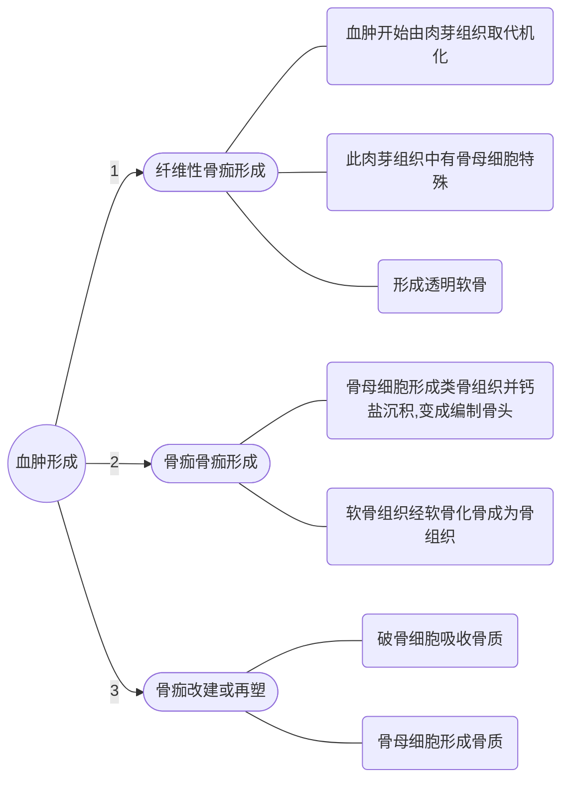

# 病理学

## 第一章 细胞和组织的适应与损伤

**名词解释：**
1. Adaptation：细胞和由其构成的组织、器官对内外环境中各种有害因子的刺激作用而产生的非损伤性应答反应。 
2. Atrophy：已发育正常的实质细胞、组织或器官的体积缩小。 
3. Hypertrophy：由于功能增加、合成代谢旺盛，使细胞、组织或器官的体积增大。 
4. Hyperplasia：组织或器官内实质细胞的数量增多。 
5. Metaplasia：一种分化成熟的细胞类型被另一种分化成熟的细胞类型所取代的过程。 
6. Reversible injury/Degeneration：细胞或细胞间质受损伤后，由于代谢障碍，细胞或细胞间质内出现异常物质或正常物质异常蓄积的现象，通常伴游功能低下。 
7. 虎斑心：心肌的脂肪变性，常累及左心室内膜下和乳头肌部位，脂肪变性的心肌呈黄色，与正常心肌的暗红色相间，形成黄红色斑纹，称为虎斑心。 ^5fff0a
8. 坏死：是以酶融性变化为特点的活体内局部组织细胞的死亡。

> 另外注意一下：干酪样坏死，坏疽；糜烂、溃疡、窦道、瘘管、空洞概念上的差别；机化、包裹在概念上的差别。

### 第一节 细胞和组织的适应

1. 萎缩病理性萎缩分为5种：营养不良性、压迫性、失用性、去神经性、内分泌性
	- 特点：细胞、组织、器官体积减小，重量减轻，颜色变深（脂褐素颗粒）细胞器大量退化，间质增生。功能下降。
	- 未曾发育 or 发育不全不属于萎缩。
	- 间质成纤维细胞和脂肪细胞增生可造成假性肥大。
1. 肥大特点：细胞、组织、器官体积增大，代谢旺盛，细胞器增多，DNA 增多。功能增强
	- 过度引起失代偿（如心肌过度肥大诱发心力衰竭）
1. 增生弥漫性或结节性
	- 过度失控可演变为肿瘤。
1. 化生是由该处具有分裂增殖和多向分化能力的幼稚未分化细胞或干细胞转分化。
	- 鳞化、肠化

### 第二节 细胞和组织的损伤

原因和机制了解一下就行了，不必细究。

#### 损伤的形式和形态学变化

**可逆性损伤／变性：**
1. 细胞水肿/水变性：（细胞损伤中最早最轻的改变）
	- 病因：mt 受损 ATP 生成减少，细胞膜 Na－K 泵功能障碍导致胞内 Na 和水过多积聚。即凡是能引起细胞内液体和离子稳态变化的损伤均可致。
	- 大体：器官体积增大，包膜紧张，切面包膜外翻，色泽淡呈水煮样。
	- 镜下：细胞体积增大，胞浆淡染，出现细颗粒状物，极期呈气球样。
2. 脂肪变：TG 蓄积于非脂肪细胞的细胞质中称为脂肪变。
	- 病因：各种原因（感染、酗酒、中毒、缺氧、营养不良、肥胖、糖尿病等）导致的脂肪代谢障碍。多发于肝、心肌、肾小管上皮，骨骼肌细胞。
	- 大体：器官体积增大，边缘钝，灰黄或黄白色，切面有油腻感。
	- 镜下：胞浆内可见脂滴或脂肪空泡。
	- 肝：“大黄油”；
	- 心肌：[虎斑心](private/01-Diary/本周事务/病理学.md#^5fff0a) 间质中脂肪增加称脂肪浸润。
1. 玻璃样变/透明变：胞内或间质中出现均质淡嗜伊红半透明状的蛋白质蓄积。
	- 类型细胞内：均质红染的圆形小体。肝细胞－Mallory 小体；浆细胞－Rusell 小体
	- 纤维结缔组织：胶原纤维交联、变性、融合，是其老化的表现。多见于瘢痕组织，AS斑块。
	- 细动脉壁：主要为高血压引起。
4. 淀粉样变：细胞间质，特别是小血管基底膜出现淀粉样蛋白质－粘多糖复合物沉积。刚果红染为橘红色。镜下见淡红色均质无结构物。
5. 黏液样变：细胞间质内粘多糖和蛋白质的蓄积。
6. 病理性色素沉着：含铁血黄素、脂褐素、黑色素、胆红素、粉尘，色素等增多并积聚于细胞内外。
7. 病理性钙化：骨、牙之外的组织中有固态钙盐的沉积。
	- 营养不良性钙化：钙盐沉积于坏死或即将坏死的组织或异物中。（Ca、P代谢正常）
	- 转移性钙化：全身 Ca、P 代谢失调，钙盐沉积于正常组织。
**不可逆损伤－坏死**
- 核的变化：核固缩，核碎裂，核融解
- 胞浆的变化：变性蛋白质增多，糖原颗粒减少，嗜酸性增强，mt 空泡化，溶酶体释放酸性水解酶
- 间质的变化：基质和胶原纤维崩解液化
类型——
1. 凝固性坏死：蛋白质凝固变性且溶酶体酶水解作用较弱，坏死去呈灰黄、灰白色，干燥。心、肝、肾、脾多见。
	- 大体：组织肿胀，结构模糊，周围与正常组织有充血－出血带分界。
	- 镜下：组织结构消失，但轮廓尚在
	- <u>干酪样坏死</u>：病灶中脂质较多，坏死区色黄，无组织轮廓，是更彻底的凝固性坏死。
2. 液化性坏死：由于坏死组织中可凝固蛋白质较少而磷脂水分较多，或中性粒细胞释放水解酶。
**特殊形式－脂肪坏死。**
脂肪坏死后可形成灰白色钙皂
3. 纤维素样坏死：是结缔组织核小血管常见的坏死形式。
4. 坏疽：组织坏死并继发腐败菌感染。分干性、湿性、气性。（注意三者区别）
	- 干性：动脉阻塞而静脉回流通畅。多见四肢末端。坏死区干燥皱缩呈黑色。与正常组织分界明显 ——多为凝固性坏死
	- 湿性：动脉阻塞且静脉回流受阻。多见于内脏或四肢。组织肿胀，黑、软、臭，与正常组织分界不清。腐败重。
	- 气性：深部创伤伴厌氧菌感染。产生大量气体，有捻发感。
结局——
1. 局部炎症反应
2. 融解、吸收
3. 分离、排出
	- 糜烂（浅）；溃疡（深）
	- 瘘管：两端开口的通道样缺损
	- 窦道：一端开口于皮肤粘膜或管腔的深在性盲管。
	- 空洞：坏死物经自然管道排出后留下的空腔。
4. 机化、包裹：新生肉芽组织长入并取代坏死组织、血栓等称机化；肉芽组织不能长入而将其包围称包裹。
5. 钙化：营养不良性钙化

### 第三节 细胞凋亡（了解概念及形态特点即可）

凋亡：亦称程序性细胞死亡，是由体内外某些因素触发细胞预存的死亡程序引起的细胞主动性死亡。
凋亡细胞分散存在，形成凋亡小体，DNA有规律断裂。不引起炎症反应。

---

## 第二章 损伤的修复

**名词解释：**
1. Repair：损伤造成机体部分细胞和组织丧失后，机体对所形成的缺损进行修补恢复的过程。
2. Regeneration：组织损伤后，由周围的同种正常细胞通过分裂增殖完成修复的过程。
3. Granulation tissue：由新生的薄壁毛细血管以及增生的成纤维细胞构成的幼稚结缔组织，并伴有炎性细胞浸润，肉眼表现为鲜红色，颗粒状，柔软湿润。
4. Wound healing：机体受到外力作用，皮肤等组织出现断裂和缺损后的愈复过程，包括各种组织的再生和肉芽组织的增生，瘢痕形成的复杂组合。
5. 创伤性神经瘤：神经纤维的修复过程中，再生轴突均不能达到远端，而与增生的结缔组织混杂在一起，卷曲成团，形成创伤性神经瘤，可发生顽固性疼痛。

### 第一节 再生

细胞的再生能力。人体细胞按再生能力分：（掌握）

1. 不稳定细胞：又称持续分裂细胞。再生能力强，总在不断增殖。干细胞的存在是组织不断更新的必要条件。表皮细胞，呼吸道、消化道粘膜细胞等。
2. 稳定细胞：又称静止细胞。增殖现象不明显，长期处于 G0期，组织受损后转入 G1期，表现较强再生能力。肝、胰、内分泌腺、肾小管上皮等。
3. 永久性细胞：又称非分裂细胞。出生后不能分裂增殖。神经细胞（不含神经纤维）、心肌细胞、骨骼肌细胞。

组织的再生（熟悉）

1. 上皮组织。
    1. 被覆上皮：由创缘或底部的基底层细胞分裂增生。
    2. 腺上皮：
        1. 单层多层基底膜未破坏：残存细胞分裂补充，能完全恢复。 
        2. 腺体构造（含基底膜）完全破坏：难以再生。（实例－肝：三种情况）

2. 纤维组织。纤维细胞、间叶细胞 $\Rightarrow$ 成纤维细胞 $\Rightarrow$ 前胶原蛋白 $\Rightarrow$ 胶原蛋白
3. 软骨组织。起始于软骨膜的增生，增生的幼稚细胞 $\Rightarrow$ 软骨母细胞 $\Rightarrow$ 软骨基质 $\Rightarrow$ 软骨
4. 血管。
    1. 毛细血管：以出芽的方式完成的。出芽 $\Rightarrow$ 细胞索 $\Rightarrow$ 出现管腔 $\Rightarrow$ 新生毛细血管 
    2. 大血管：内膜恢复，肌层不易再生，形成瘢痕。
5. 肌组织。
    1. 肌膜未破坏：残存部分肌细胞分裂形成肌原纤维，恢复正常。2. 
    2. 肌纤维完全断裂：瘢痕愈合，但仍可收缩。

细胞再生的影响因素：（了解）
人工干预下的组织再生：（了解）

### 第二节 纤维性修复

这种修复首先通过肉芽组织的增生，融解吸收受损部位的坏死组织及其它物，并填补组织缺损，以后肉芽组织转化为以胶原纤维为主的瘢痕组织。

**肉芽组织的形态及作用（掌握）**

- <u>毛细血管</u>垂直创面生长，血管周围有许多新生<u>成纤维细胞</u>，<u>炎细胞</u>浸润以巨噬细胞为主。部分成纤维细胞含肌丝，有收缩功能，称肌成纤维细胞。无神经
- 作用：抗感染保护创面；填补创口组织缺损；机化或包裹坏死、血栓、炎性渗出物、异物。
- 炎细胞浸润减少；毛细血管减少，部分改建为小 A 小 V；成纤维细胞转变为纤维细胞 $\Rightarrow$ 胶原纤维玻璃样变性，成熟为结缔组织 $\Rightarrow$ 瘢痕组织。

> [注意与肉芽肿的区别](private/01-Diary/本周事务/病理学.md#^eff944)

^94376b

**瘢痕组织的形态及作用（熟悉）**

- 大量平行或交错分布的胶原纤维束，往往玻璃样变性。
- 作用：
	- 利:保持组织完整性；保持组织器官坚固性
	- 弊:瘢痕收缩，关节活动受限；瘢痕性粘连；器官硬化；过度增生，突出皮肤称瘢痕疙瘩（蟹足肿）

### 第三节 创伤愈合

**皮肤**

基本过程：

- 伤口的早期变化：组织坏死，血管出血，出现炎症反应。中性粒细胞浸润，3d 后转为巨噬细胞
- 伤口收缩：伤口边缘的肌成纤维细胞牵拉
- 肉芽组织增生、瘢痕形成：第3d 起长出肉芽组织，逐渐形成瘢痕
- 表皮及其它组织再生：伤口边缘的基底细胞增生，向中心迁移，覆盖于肉芽组织表面并分化，皮肤附属器完全破坏不可再生，肌腱可完全再生。

创伤愈合类型：
| N/A | 一期愈合 | 二期愈合 |
| ---- | ---------------------------------------------------------------------------------------------------------------- | ------------------------------------------------------------------------------------------ |
| 条件 | 组织缺损少，创缘整齐，无感染经粘合或缝合后对合严密 | 组织缺损大，创缘不齐，无法对合或有感染 |
| 过程 | 炎症反应轻，表皮在24～48h覆盖伤口，肉芽组织第3d长出，很快填满伤口，5～7d伤口两侧出现胶原纤维连接，达到愈合标准。 | 坏死组织多，炎症反应重，需大量肉芽组织将缺损填平后表皮方能覆盖，伤口收缩明显，愈合时间长。 |
| 结果 |瘢痕小，细线状 |瘢痕大|

**骨折：骨母细胞分裂增殖**

**影响创伤愈合的因素（了解）**
全身：含硫氨基酸，Vc，Zn等；局部。影响骨折的因素：……

## 第三章 局部血液循环障碍

**名词解释：**
1. Congestion/Venous hyperemia：器官或局部组织静脉回流受阻，血液淤积于小静脉和毛细血管内。
2. Thrombosis：在活体的心脏和血管内，血液发生凝固或血液中的有形成分凝集成固体质块的过程。所形成的固体质块称为 Thrombus。
3. Embolism：在循环血液中出现的不溶于血液的异常物质，随血液运行阻塞血管的现象，阻塞血管的异常物质叫 Embolus。
4. Infarction：器官或局部组织由于血管阻塞、血流停止导致缺氧而发生的坏死。
5. 心衰细胞：肺淤血时，出现淤血性出血，肺泡腔内出现的红细胞被巨噬细胞吞噬，血红蛋白转变为含铁血黄素，这种细胞常在心力衰竭时出现，故谓之心衰细胞。
6. 槟榔肝：慢性肝淤血时，肝小叶中央区细胞萎缩坏死，严重淤血而呈暗红色，肝小叶周边部肝细胞因脂肪变性呈黄色，致使肝切面出现黄红相间的槟榔状花纹。

另外，了解一下减压后充血、淤血性出血、淤血性肝硬化、DIC 

血液循环障碍的表现：血管内成分逸出血管外；局部组织血管内血液含量异常；血液内出现异常物质。

### 第一节 充血和淤血
**充血**
动脉输入血量增多，是主动过程，表现为局部小动脉和毛细血管扩张，血输入量增加。是暂时的、可逆的。
**淤血**
又称静脉性充血，是被动过程。
- 原因：静脉受压；静脉腔阻塞；心力衰竭。
- 病变：体积增大，色暗红，局部血停止，毛细血管扩张，散热增加，温度下降，血管内红细胞积聚。水、盐、少量蛋白质形成漏出液。（与渗出液的区别【链】）
- 后果：引起淤血性水肿，若红细胞漏出则为淤血性出血。实质细胞萎缩、死亡，器官出现淤血性硬化；侧支循环建立。

**肺淤血**

| N/A | 急性 | 慢性 |
| ---- | ------------------------------------------------------------------------------------ | ---------------------------------------------------------------------------------- |
| 起因 | 左心衰竭 | 二尖瓣狭窄，有心衰史 |
| 大体 | 肺体积增大，肿胀，质实，肺膜光滑，色暗红，切面有泡沫状血性液体流出 | 肺体积增大，肿胀，质实，肺膜光滑，色暗红，切面有泡沫状血性液体流出 |
| 镜下 | 肺泡壁毛细血管扩张，呈“串珠状”突起。肺泡壁增厚，肺泡间隔水肿，部分腔内有水肿液及出血 | 毛细血管扩张更明显，肺泡壁变厚并纤维化，腔内出有水肿液，出血，心衰细胞，肺褐色硬化 |
|特征|毛细血管“串珠样”突起，咳粉红色泡沫样痰|纤维组织增生，有心衰细胞，咳铁锈色痰|

**肝淤血**
- 急性：
- 慢性
    - 大体：体积增大，包膜紧张，质实，槟榔肝（有什么特征？）- 
    - 镜下：槟榔肝的镜下特征？ 
    - 长期肝淤血，小叶中央肝细胞萎缩消失，网状纤维塌陷后胶原化，贮脂细胞增生，合成胶原纤维增多，加上门管区纤维结缔组织增生，致使整个肝间质纤维组织增多，形成淤血性肝硬化。

### 第二节出血

红细胞逸出至血管外为主要指标。分破裂性和漏出性。
- 破裂性：心脏或血管壁破裂。
- 漏出性：血管的通透性增高。
	- 内出血逸入体腔或组织。 
	- 外出血流出体外。鼻衄、呕血、咯血、便血、尿血、淤点、紫癜、淤瘢。

### 第三节 血栓形成

形成条件：
- 心血管内皮细胞损伤——血栓形成的最重要最常见的原因
	- 黏附反应；释放反应；粘集反应
- 血流状态的改变——主要是血流减慢、血流产生漩涡。
	- 血小板进入边流，增加血小板与内膜的接触机会和黏附的可能性。静脉易发。
- 血液凝固性的增加——血小板和凝血因子增多，或纤维蛋白融解系统活性降低，导致呈高凝状态。

血栓的形成过程及形态：

    
     
    
沿这三步发展而成的称延续性血栓
    

- 透明血栓发生于微循环的血管内，主要为毛细血管。由纤维蛋白构成。又称纤维素性血栓。常见于 DIC。
**血栓的结局**
- 软化、溶解、吸收：
- 机化、再通：存在较长时间发生机化；也可由新生血管内皮长入裂隙并吻合沟通形成再通
- 钙化：称为静脉石或动脉石。
**血栓对机体的影响**
- 阻塞血管：引起局部器官或组织缺血，实质细胞萎缩，无侧支循环建立则导致梗死。
- 栓塞：与血管壁粘着不牢或软化过程中脱落形成栓子。
- 心瓣膜变形：
- 广泛性出血：见于 DIC 透明血栓形成，消耗大量凝血物质，易引起广泛性出血。

### 第四节 栓塞

**栓子的运行途径**

- 静脉系统及右心栓子：引起肺栓塞
- 主动脉及左心栓子：阻塞脑、脾、肾、四肢的指、趾。
- 门静脉系统栓子：引起肝内门静脉分支的栓塞。 
    - 交叉性栓塞：来自右心或腔静脉的栓子再右心压力升高时通过房（室）间隔进入体循环。 
    - 逆行性栓塞：下腔静脉的血栓在胸腹压突升时逆流入肝肾髂静脉分支。
**栓塞类型**
- 固：脱落的血栓、细菌菌落、肿瘤細胞团块、寄生虫和异物 
- 液：脂肪和羊水 
- 气：空气和氮气 
### 第五节 梗死
梗死一般是动脉的阻塞引起的局部组织缺血坏死，静脉阻塞也可。
- 原因：血栓形成（主）；动脉栓塞；动脉痉挛；血管受压闭塞
- 条件：不能建立有效的侧支循环；各组织对缺血的敏感度不同。
**梗死的病变及类型**
- 梗死灶的形状：取决于血管的分布。脾、肺、肾呈锥形、扇形；心肌呈地图形。
- 梗死灶的质地：取决于坏死的类型。
- 梗死的颜色：取决于含血量。贫血性梗死呈灰白色，出血性梗死色暗红。
    - 贫血性梗死：发生于组织结构较致密侧支循环不充分的实质性器官，脾、肾、心、脑。充血出血带明显。脑梗死一般为贫血性梗死，梗死灶液化呈囊状。
    - 出血性梗死：
        1. 严重淤血器官原有严重淤血，血管又被阻塞。
        2. 组织疏松
    - 肺出血性梗死
    - 肠出血性梗死
    - 败血性梗死：由含有细菌的栓子栓塞引起。
**梗死的影响及结局**

## 第四章 炎症
**名词解释：**
1. Inflammation：具有血管系统的生活机体对损伤因子所发生的复杂防御反应，是损伤、抗损伤和修复三位一体的综合过程。
2. 变质：炎症局部组织发生的变性和坏死。
3. 渗出：炎症局部组织血管内的液体成分、纤维蛋白原等蛋白质和各类炎症细胞通过血管壁进入组织、体腔、体表的过程。
4. 伪膜性炎：发生于粘膜的纤维素性炎，渗出的纤维蛋白、坏死组织和中性粒细胞共同构成伪膜。还可有细菌。
5. 绒毛心：心外膜腔渗出以纤维素为主时，覆盖于心外膜表面的纤维素可因心脏的不停跳动和牵拉形成绒毛状，称为绒毛心。
6. 蜂窝织炎（Phlegmonous Inflammation）：指结缔组织的弥漫性化脓性炎，表现为大量中性粒细胞的弥漫性浸润。
7. Abscess：局限性的化脓性炎症，组织发生溶解坏死，形成充满脓液的腔。
8. 毒血症：细菌的毒性产物或毒素吸收入血。
9. 菌血症：细菌由局部病灶入血，全身无中毒症状，但可从血液中查到细菌。
10. 败血症：细菌从局部病入血后，不仅没被清除，反而大量繁殖并产生毒素，引起全身的中毒症状和病理变化。
11. 脓毒血症：由化脓性细菌引起的败血症。
12. 肉芽肿：由渗出的单核细胞和以局部增生的巨噬细胞形成的界限清楚的结节状病灶。[注意与肉芽组织的区别](private/01-Diary/本周事务/病理学.md#^94376b) ^eff944

### 第一节炎症概述

<u>血管反应</u>是炎症的中心环节！

**炎症的原因（了解）**

**基本病理变化：变质渗出增生**

- 变质：可发生于实质和间质细胞。实质细胞包括细胞水肿，脂肪变，细胞凝固性坏死和液化性坏死等。间质细胞包括粘液变性和纤维素样坏死等。
- 渗出：渗出液与单纯血液循环障碍引起的漏出液（【链】）区别在于前者蛋白质含量较高，含有较多细胞和细胞碎片，外观浑浊，能自凝。
- 增生：包括实质、间质细胞。间质细胞的增生包括巨噬细胞、内皮细胞和成纤维细胞（即形成肉芽组织）。
**局部表现和全身反应**
- 局部：红、肿、热、痛、功能障碍
- 全身：发热、嗜睡、厌食，肌肉蛋白降解加速，补体和凝血因子增多，WBC 数目（核左移）改变。

| | 急性 | 慢性 |
| -------- | ------------------ | ---------- |
| 病程 | 几天，不超过一个月 | 数月、数年 |
| 病理变化 | 渗出为主 | 增生为主 |
| 细胞浸润 | 中性粒细胞 |淋巴、单核细胞|

### 第二节 急性炎症

**血液动力学改变**

    
     
    
血液动力学改变
    

**血管通透性增加**

炎症过程中，富含蛋白质的液体渗出，聚集在间质中称为炎性水肿。聚集于浆膜腔称炎性积液。（引起“肿”）引起的原因有：血管扩张和血流加速引起的静力压升高和血浆超滤；蛋白质渗出使血浆胶体压降低；其它因素导致的通透性增加。
- 内皮细胞的改变：7个要点（自己看书）
- 炎性水肿
    - 利：
    	- 稀释毒素；
        - 带来营养物质，带走代谢产物；
        - 带来 Ab、C；
        - 纤维素限制病原体扩散有利吞噬；
        - 病原体、毒素能刺激免疫
    - 弊：
        - 量多使压迫器官
